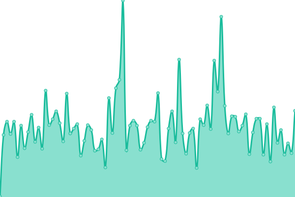
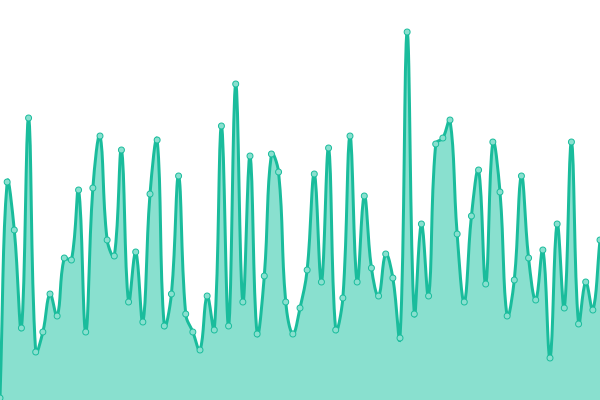
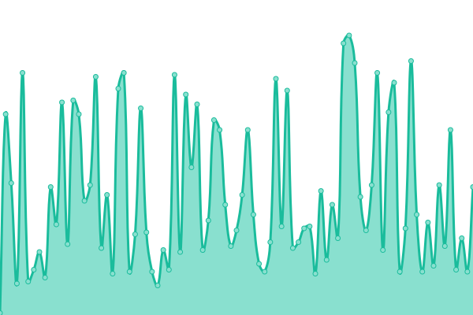
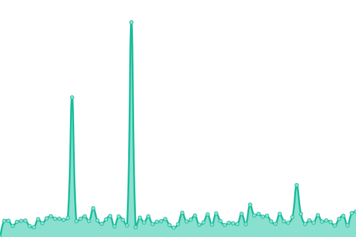

# [📈 Live Status](https://demo.upptime.js.org): <!--live status--> **🟩 All systems operational**

<!--start: status pages-->
<!-- This summary is generated by Upptime (https://github.com/upptime/upptime) -->
<!-- Do not edit this manually, your changes will be overwritten -->
<!-- prettier-ignore -->
| URL | Status | History | Response Time | Uptime |
| --- | ------ | ------- | ------------- | ------ |
|  [🏠 Mostlai's Blog](https://mostlai.github.io/) | 🟩 Up | [mostlai-s-blog.yml](https://github.com/Mostlai/mostlai-status/commits/HEAD/history/mostlai-s-blog.yml) | 

 129ms
     
 | 

<a href="https://mostlai.github.io/mostlai-status/history/mostlai-s-blog">100.00%</a>
    

|  [🌏 Mostlai's Hundred-Days](https://mostlai.github.io/Hundred-days/) | 🟩 Up | [mostlai-s-hundred-days.yml](https://github.com/Mostlai/mostlai-status/commits/HEAD/history/mostlai-s-hundred-days.yml) | 

 61ms
     
 | 

<a href="https://mostlai.github.io/mostlai-status/history/mostlai-s-hundred-days">100.00%</a>
    

|  [🌙 Mostlai's HD-TEST](https://mostlai.github.io/HD-TEST/) | 🟩 Up | [mostlai-s-hd-test.yml](https://github.com/Mostlai/mostlai-status/commits/HEAD/history/mostlai-s-hd-test.yml) | 

 54ms
     
 | 

<a href="https://mostlai.github.io/mostlai-status/history/mostlai-s-hd-test">100.00%</a>
    

|  [📖 Mostlai's HD-WIKI](https://mostlai.github.io/HD-WIKI/) | 🟩 Up | [mostlai-s-hd-wiki.yml](https://github.com/Mostlai/mostlai-status/commits/HEAD/history/mostlai-s-hd-wiki.yml) | 

 330ms
     
 | 

<a href="https://mostlai.github.io/mostlai-status/history/mostlai-s-hd-wiki">100.00%</a>
    

<!--end: status pages-->

## 📄 License

- Powered by: [Upptime](https://github.com/upptime/upptime)
- Code: [MIT](./LICENSE) © [Ask sky](mostlai.github.io)
- Data in the `./history` directory: [Open Database License](https://opendatacommons.org/licenses/odbl/1-0/)
